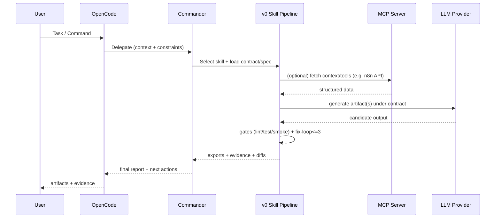

Ich lese jetzt zuerst alle lokalen Projektdateien aus deinem ZIP vollständig, extrahiere Fakten + Konflikte, dann mache ich Web-Checks der kritischen Komponenten (OpenCode/Plugins/Moltbot/n8n/MCP/COSMIC) und liefere danach eine einzige, umsetzbare SSOT-Datei `IMPLEMENTATION-PLAN.md` inkl. Coverage-Matrix und deduped Sources.


# IMPLEMENTATION-PLAN.md

**Stand:** 2026-02-01 (Europe/Berlin)
**Ziel:** WANDA Root als deterministisches, reproduzierbares „Sovereign AI OS“ mit **Contract-first Skills/Pipelines** (v0-style) + **OpenCode-Orchestrierung** + optionaler **Voice/Chat-Frontdoor**.

---

## 1) Executive Summary

### 1.1 Was ist WANDA, was baut es konkret?

WANDA ist ein **lokales, deterministisches Multi-Agent-System** rund um **OpenCode** als TUI/CLI-Orchestrator. WANDA erzwingt eine Arbeitsweise „**Contracts → Pipelines → Proof**“ statt freier Prompts:

* **OpenCode Core**: Chat/Agent-Orchestrierung, Tools/MCP, Plugin-System, Skills
* **Skill Registry** (`.v0/`): **Contracts/Specs/Runs/Exports** als SSOT für Output-Artefakte (Webapps, n8n-Workflows, Ops)
* **Ingress (optional)**: Voice/Chat Frontdoor (historisch „Clawdbot/Moltbot“, heute in Doku/Ökosystem teils als OpenClaw rebrandet; siehe Konflikte & ASSUMPTION)
* **Ledger/Continuity**: Logging, Run-Evidence, Fix-Loop-Gates, Dokumentationspflicht

### 1.2 Subsysteme (SSOT)

1. **Voice/Chat Ingress** (optional): WhatsApp/Voice → Policy Gate → „Task“-Dispatch → OpenCode
2. **OpenCode Core**: Agenten, Plugins, Tools, Skills
3. **Skills Platform**: `.v0/` als Contract-first Pipeline Engine
4. **Runners** (optional): systemd user services / cron / GitHub App
5. **Ledger/Continuity**: Run-Protokolle, Evidence, Backups

---

### 1.3 Local File Inventory (Audit Output)

| Pfad                                             | Zweck/Scope                      | Zentrale Aussagen/Fakten                                                   | Abhängigkeiten               | Offene Fragen / Konflikte                                                |
| ------------------------------------------------ | -------------------------------- | -------------------------------------------------------------------------- | ---------------------------- | ------------------------------------------------------------------------ |
| `README.md`                                      | Einstieg, Doku-Index, Quickstart | WANDA als Root, verweist auf Blueprint/Handbook/Setup                      | OpenCode, `.v0`, Moltbot     | Quickstart nutzt `/ralph-loop` → Quelle/Plugin unklar (ASSUMPTION)       |
| `docs/WANDA_FINAL_BLUEPRINT.md`                  | Master Blueprint (v2.0)          | Roster, Skills v0_web/v0_n8n/v0_ops, Frontdoor, 8-Phasen                   | OpenCode, `.v0`, Moltbot     | `.v0` teils als `~/.v0` beschrieben → Konflikt mit `technical.md`        |
| `docs/WANDA_HANDBOOK.html`                       | Lesbare Gesamtsicht              | Commander als Main, Sisyphus/Planner deaktiviert; Skill Registry; Gateway  | OpenCode, `.v0`, Moltbot     | Template-artige Modellnamen („Gemini 3 Pro“) vs echte Modell-IDs         |
| `docs/BEI PROBLEMEN.md`                          | Troubleshooting-Links            | Verweist auf OpenCode Docs, Plugin Docs, Voice Quellen                     | Web-Quellen                  | Dopplung zu Blueprint; keine neuen Fixes                                 |
| `docs/workflows/wanda-lifecycle.md`              | 8-Phasen-Protokoll               | Brainstorm → Research → Init → Implement → Test → Refactor → Deploy → Loop | OpenCode                     | Muss als Quality-Gate SSOT im Plan verankert werden                      |
| `docs/guides/setup.md`                           | Install/Setup (lokal)            | Bun/Node, OpenCode Install, Moltbot Install, Init-Skelett, Verify          | Bun, Node, OpenCode, Moltbot | Install-Kommandos web-verifizieren; Moltbot Install evtl. veraltet       |
| `docs/guides/contributing.md`                    | Regeln/Governance                | Patch Protocol, Fix-Loop max 3, Secrets Hygiene, Tool Safety               | Git, CI, Lint/Test           | Muss als Quality Gates in Skills übernommen werden                       |
| `docs/architecture/vision.md`                    | Vision/Scope                     | „v0 für alles“; Skills; Frontdoor; Security Model                          | v0-style Workflow            | Muss präzisiert werden: echte Ordner/Artefakte/DoD                       |
| `docs/architecture/technical.md`                 | Architektur/Struktur             | `.v0/` Ordnerstruktur (projektlokal), Runner, Memory                       | `.v0`                        | Konflikt: Blueprint nennt `~/.v0`                                        |
| `docs/architecture/agents.md`                    | Agenten/Rollen                   | Dual-Quota-Idee, Fallback Chain, MCP/Tools, Config-Paths                   | OpenCode Plugins, MCP        | Modellmatrix und Provider-IDs unklar/zu generisch                        |
| `docs/architecture/agent-roster.md`              | Finaler Roster (lokal SSOT)      | Commander (MiCode) primary; Subagenten; deaktivierte Hauptagenten          | MiCode, oh-my-opencode       | Muss mit Template konsolidiert werden                                    |
| `docs/architecture/plugin-standards.md`          | Plugin Inventory (lokal SSOT)    | Core OpenCode + oh-my + micode; beschreibt (legacy) opencode-orchestrator  | OpenCode Plugins             | **Konflikt**: „opencode-orchestrator“ Bedeutungen (Plugin vs GitHub App) |
| `docs/research/research-agent-architecture.md`   | SOTA Agent Architektur           | Layering, Sicherheit, Observability                                        | MCP                          | Konzeptionell; braucht Umsetzung in SSOT                                 |
| `docs/research/research-agent-creation-guide.md` | Agent Best Practices             | Python-first, Tool/MCP, Testing, Docs                                      | MCP                          | Konzeptionell; in Quality Gates spiegeln                                 |
| `docs/research/research-agent-reduction.md`      | Agenten-Reduktion                | Redundanzabbau                                                             | –                            | Konflikt zu „17 Agents“ in Template                                      |
| `docs/research/research-opencode-analysis.md`    | OpenCode Deep Report             | Install/Lifecycle/Config/Agenten                                           | OpenCode Docs                | Muss gegen aktuelle Docs gegengecheckt werden                            |
| `docs/research/research-plugin-analysis.md`      | Plugin/Agent Analyse             | Commander-Fall, Plugin-Strategie                                           | OpenCode Ecosystem           | Muss mit aktuellen Plugin-Quellen abgeglichen werden                     |
| `docs/research/research-sota-optimization.md`    | Optimierung 2026                 | Konsolidierung, MCP Audit                                                  | –                            | Enthält Empfehlungen → als SSOT-Entscheidungen festlegen                 |
| `docs/research/research-v0-builder-platform.md`  | Skill-Plattform Design           | Contracts, Router Policies, Troubleshooting Map                            | `.v0`                        | Umsetzung in echte Dateistruktur/DoD                                     |
| `docs/research/research-voice-gateway.md`        | Voice Gateway Design             | Config, Approval Gates, Bridge Specs                                       | Moltbot/Clawdbot             | Rebrand/aktuelle CLI unklar → web-verifizieren                           |
| `docs/research/research-sources.md`              | Quellenliste (lokal)             | Link-Sammlung für OpenCode/Voice/n8n/MCP                                   | Web                          | Muss deduped & aktualisiert werden                                       |
| `templates/AGENTS.md.template`                   | Template (system kernel)         | Sisyphus orchestrator, 17 agents, Layer                                    | –                            | **Widerspricht** agent-roster (Commander primary)                        |

---

### 1.4 Konsistenz-Audit: Konflikte, Auflösung, SSOT-Entscheidungen

**C-001 — Main Orchestrator: Commander vs Sisyphus**

* Betroffen: `templates/AGENTS.md.template` vs `docs/architecture/agent-roster.md` / Handbook
* Konflikt: Template sagt Sisyphus orchestrator; Roster/Handbook sagt Commander primary, Sisyphus deaktiviert.
* **SSOT-Entscheidung:** Commander ist Primary. Sisyphus bleibt **deaktiviert**.
* Verifikation: In OpenCode Agent-Liste muss Commander als „main“ aktiv sein; Sisyphus nicht als primary.

**C-002 — Agentenanzahl (17 vs 14 vs „reduced“)**

* Betroffen: Template (17), Research Reduction (14), Roster (konkrete Liste)
* **SSOT-Entscheidung:** Roster-Liste in `docs/architecture/agent-roster.md` ist kanonisch; Template ist **nur Vorlage**.

**C-003 — `.v0/` Pfad: `~/.v0` vs projektlokal `.v0/`**

* Betroffen: Blueprint/Setup (`~/.v0`) vs Technical (`.v0/`)
* **SSOT-Entscheidung:** `.v0/` liegt **im Projekt-Repo** (deterministisch, versionierbar). `~/.v0` ist optionaler Cache und nicht SSOT.

**C-004 — „opencode-orchestrator“ Bedeutung**

* Betroffen: `plugin-standards.md` (als Plugin) vs Web-Fund (als GitHub App)
* Web: „opencode-orchestrator“ ist ein **GitHub App/Automations-Orchestrator**, nicht zwingend ein OpenCode-CLI-Plugin. ([GitHub][1])
* **SSOT-Entscheidung:** Kein Pflicht-Plugin. Wenn genutzt, dann als **separates System** (GitHub App/Automation), nicht als Core für lokale WANDA-CLI.

**C-005 — Antigravity Quota Plugin Name**

* Wunschliste: `opencode-antigravity-quota@latest`
* Web: `opencode-google-antigravity-auth` existiert und beschreibt u. a. Search-Wrapper/Tool-Limitation-Fix + Update/Cache-Hinweise. ([GitHub][2])
* **SSOT-Entscheidung:** Verwende `opencode-google-antigravity-auth@latest` als kanonische Antigravity-Komponente, bis `opencode-antigravity-quota` tatsächlich mit Doku verifiziert ist.

**C-006 — Modellnamen („Gemini 3 Pro“) vs echte Modell-IDs**

* Web: Beispiel-IDs wie `gemini-2.5-flash`, `gemini-2.5-pro`, `gemini-3-pro-preview`, `gemini-3-flash-preview` sind in Plugin-Readmes dokumentiert. ([GitHub][3])
* **SSOT-Entscheidung:** In Config/Skills werden **nur echte Modell-IDs** verwendet. „Gemini 3 Pro“ bleibt als **Alias im Glossar**.

**C-007 — Dual-Quota (Gemini CLI OAuth vs Antigravity OAuth) in einem Setup**

* Web: `opencode-gemini-auth` nutzt Google OAuth/Gemini Plan/Quotas. ([GitHub][3])
* Web: Antigravity-Plugin adressiert Gemini API Tool-Limitation und hat eigenes Account-Handling/Cache. ([GitHub][2])
* **SSOT-Entscheidung (deterministisch):** **Zwei getrennte OpenCode-Profile** (getrennte `XDG_CONFIG_HOME`/`XDG_DATA_HOME`) für harte Quota-Trennung. Single-Profile „beides gleichzeitig“ ist möglich, aber **ASSUMPTION** bis per OpenCode Auth-Store eindeutig verifiziert.

---

## 2) Goals / Non-Goals

### Goals

* **Blind reproduzierbar**: Ein anderes System kann WANDA ohne Rückfragen aufsetzen.
* **Deterministisch**: Jede Pipeline hat Input/Output/DoD, Fix-Loop max 3.
* **Security-first**: Secrets, MCP-Risiken, Supply-chain, Approvals.
* **Up-to-date Komponenten**: OpenCode Plugin-Ökosystem & relevante Tools gegengecheckt.

### Non-Goals

* Vollautomatische Voice/Telephony-Produktionseinführung (nur MVP + sichere Defaults)
* Perfektes Modell-Tuning/Prompt-Perf (nur SSOT + Gates + Fallbacks)
* Vollständige CI/CD-Produktionsplattform (nur minimaler Runner/Deploy-Plan)

---

## 3) Glossary

* **SSOT**: Single Source of Truth – kanonische, versionierbare Definition.
* **Contract-first**: Erst Schema/Spec, dann Implementation (z. B. `UI_SPEC.yml` → App).
* **Skill**: Wiederholbarer Pipeline-Typ (z. B. `v0_web`).
* **Run Evidence**: Logs/Artefakte, die beweisen, dass ein Run grün war.
* **Fix-Loop max 3**: Maximal 3 automatische Reparaturversuche pro Fehlerklasse; danach Root-Cause.
* **MCP**: Protokoll, über das Tools/Resources von Servern an LLM-Clients exponiert werden. ([modelcontextprotocol.io][4])
* **Tool (MCP)**: Benannte Funktion mit Schema, die ein Modell aufrufen kann. ([modelcontextprotocol.io][5])
* **Confused Deputy**: Sicherheitsproblem bei Proxy-Servern/Delegation (MCP Security). ([modelcontextprotocol.io][6])

---

## 4) System Overview Diagram

```mermaid
flowchart LR
  U[User: Terminal / optional Voice/Chat] -->|Command/Intent| G[Ingress Gateway\n(optional)]
  G -->|Policy Gate + Approvals| OC[OpenCode Core\n(TUI/CLI)]
  OC -->|Delegation| A[Agent Fleet\n(Commander + Subagents)]
  A -->|Reads/Writes| V0[.v0 Skill Registry\n(contracts/specs/runs/exports)]
  A -->|Tools/MCP| MCP[MCP Servers\n(n8n, FS, Web, etc.)]
  A -->|Providers| P[(LLM Providers)\nGoogle OAuth / Antigravity / Anthropic / OpenAI]
  V0 --> L[Ledger/Continuity\nlogs, evidence, backups]
  OC --> L
  MCP --> L
```

---

## 5) Canonical Architecture

### 5.1 Komponentenbeschreibung

* **Ingress (optional)**: Multi-Channel Entry, immer mit Approval Gates, Allowlist, Log-Redaction.
* **Orchestrator (Commander)**: Entscheidet Skill, setzt DoD, delegiert an Subagenten, erzwingt Fix-Loop/Quality-Gates.
* **Skills (`v0_*`)**: Contract-first Pipelines, deren Outputs versionierbar sind.
* **Tools/MCP**: Zugriff auf externe Systeme (n8n, Filesystem, Web, etc.). MCP-Tools sind eindeutig benannt und schema-beschrieben. ([modelcontextprotocol.io][5])
* **Memory/Ledger**: Run-Logs, Evidence, Wiederherstellbarkeit.

### 5.2 Daten-/Kontrollfluss (Sequence)



---

## 6) Agent Fleet SSOT

### 6.1 Layer-Modell (Primary vs Subagenten)

* **Primary:** Commander (ein Einstiegspunkt, keine konkurrierenden „Main“-Agenten)
* **Subagenten:** Spezialisten (Research, UI, QA, Ops), rein delegiert, kein eigenständiges Routing

### 6.2 Finaler Roster (konfliktfrei)

**Primary**

* **Commander (MiCode)**: Orchestrierung, Task-Routing, Policy-Gates, Fix-Loop, Finalisierung

**Subagenten (Auszug – kanonisch aus `agent-roster.md`)**

* Core (oh-my-opencode): Oracle, Librarian, Explore, Writer, Multimodal-Looker
* Qualität/Patterns: Pattern-Hunter, Codebase-Analyzer, etc.
* UI/Ideation: Brainstormer, Frontend-Dev
* Continuity (MiCode): ledger-creator, artifact-searcher, etc.

> SSOT: Roster-Details bleiben in `.opencode/agents/` bzw. OpenCode Skill/Agent Definitions, aber die kanonische Liste ist in dieser Sektion festgeschrieben.

### 6.3 Modellzuordnung & Fallbacks/Quota-Logik

**Kanonische Modell-IDs (Beispiele, müssen in `opencode.json` definiert werden):**

* `gemini-2.5-flash`, `gemini-2.5-pro`, `gemini-3-flash-preview`, `gemini-3-pro-preview` ([GitHub][3])

**Fallback Chain (Policy)**

1. Google (Antigravity OAuth) – „heavy“ und Search-Wrapper
2. Google (Gemini CLI OAuth) – separate Quotas
3. Anthropic
4. OpenAI

**Harte Quota-Trennung (SSOT)**

* **Empfohlen:** Zwei Profile

  * `wanda-gemini-cli` (nur `opencode-gemini-auth`)
  * `wanda-antigravity` (nur `opencode-google-antigravity-auth`)
* **ASSUMPTION (optional):** Single-Profile mit beiden OAuth-Methoden parallel (nur wenn OpenCode Auth-Store wirklich beide Credentials pro Provider sauber separiert).

**Verifikation (Pflicht)**

* Nach Login muss klar sein:

  * welche Provider/Auth-Methode aktiv ist
  * welche Modelle tatsächlich verfügbar sind
  * welche Requests in welchen Bucket laufen
    (Wenn nicht eindeutig → ausschließlich 2-Profile nutzen.)

---

## 7) Plugin Inventory SSOT

### 7.1 Kanonische Pluginliste (Minimal, stabil)

**Core (Pflicht)**

1. `micode@latest` (Commander + Workflow-Struktur) ([GitHub][7])
2. `opencode-gemini-auth@latest` (Google OAuth via Gemini Plan/Quotas) ([GitHub][3])
3. `opencode-google-antigravity-auth@latest` (Antigravity OAuth + Search-Wrapper + Tool-Limitation-Fix) ([GitHub][2])

**Optional (nur wenn gebraucht)**
4) `oh-my-opencode@latest` (zusätzliche Tools/Ergonomie, Background Agents, Doctor, etc.) ([GitHub][1])
5) `opencode-handoff@latest` (handoff / prompt-to-action Bridge) ([GitHub][8])

**Nicht-kanonisch / nur nach Verifikation**

* `opencode-orchestrator@latest` (Name kollidiert mit GitHub-Orchestrator; nicht als Pflicht-Plugin) ([GitHub][1])
* `opencode-antigravity-quota@latest` (nur wenn reale Repo/Doku bestätigt; sonst ersetzen durch google-antigravity-auth)

> Referenz: OpenCode Ecosystem listet relevante Plugins wie `opencode-gemini-auth`, `opencode-antigravity-auth`, `opencode-supermemory`, `micode`, `oh-my-opencode`. ([OpenCode][9])

### 7.2 Was macht welches Plugin? (Funktionen, Overlap, Spare-Entscheidung)

#### `micode`

* Liefert „Commander“-zentriertes Workflow-Pattern und Agent-Rollen (Commander/Planner/Worker/Reviewer/Implementer). ([GitHub][7])
* **Warum Pflicht:** WANDA SSOT setzt Commander als einzigen Main.

#### `opencode-gemini-auth`

* Google OAuth für OpenCode, nutzt Gemini Plan/Quotas (kein separates API Billing). ([GitHub][3])
* Konfig: `provider.google.options.projectId` + Modellliste. ([GitHub][3])
* Troubleshooting: 429/Quota-Buckets (modellabhängig). ([GitHub][3])

#### `opencode-google-antigravity-auth`

* Fix für Gemini API Limitation: native Search-Tools können nicht mit function declarations in einem Request kombiniert werden; Plugin liefert `google_search` Wrapper-Tool (separate API Calls). ([GitHub][2])
* Enthält Update/Cache-Strategie (Plugins werden nicht auto-updated; Cache löschen). ([GitHub][2])
* Unterstützt Thinking-Konfiguration pro Modell/Variante. ([GitHub][2])

**Overlap `gemini-auth` vs `antigravity-auth`:**

* Beide arbeiten im Google-Ökosystem, aber **mit unterschiedlichen Quotas/Backends**.
* **SSOT-Entscheidung:** harte Trennung via **2 Profile** (siehe 6.3), weil Single-Profile-Trennung nicht sauber verifiziert ist.

#### `oh-my-opencode` (optional)

* Adds Tooling/Ergonomie + curated Agents/Flows; geeignet als Booster, aber nicht zwingend für WANDA-Kern. ([GitHub][1])
* **Spare-Entscheidung:** Wenn du nur Commander/Skills brauchst → weglassen. Wenn du „Doctor“, Background Agents, zusätzliche Tools willst → dazu.

#### `opencode-handoff` (optional)

* Bridge/Pattern für „handoff“ Workflows, um Zuständigkeiten/Übergaben standardisiert zu machen. ([GitHub][8])
* Kein echter Ersatz für Commander/Skills, sondern Ergänzung.

### 7.3 Load-Order & Config-Scopes

**Load-Order (SSOT, defensiv):**

1. `micode`
2. Auth-Plugins (genau eins pro Profil):

   * Profil A: `opencode-gemini-auth`
   * Profil B: `opencode-google-antigravity-auth`
3. Optional: `oh-my-opencode`
4. Optional: `opencode-handoff`

**Warum:** Auth/Provider-Hooks sollen nicht gegeneinander überschreiben. Wenn Single-Profile genutzt wird (ASSUMPTION), ist Hook-Konflikt-Risiko hoch.

### 7.4 Kanonische Config (Profile-Ansatz)

**Profil A — Gemini CLI Quota (Beispielpfad)**

* `~/.config/wanda/opencode-gemini/opencode.json`

**Profil B — Antigravity Quota (Beispielpfad)**

* `~/.config/wanda/opencode-antigravity/opencode.json`

**Wrapper (SSOT)**

```bash
# wanda-gemini
XDG_CONFIG_HOME="$HOME/.config/wanda/opencode-gemini" \
XDG_DATA_HOME="$HOME/.local/share/wanda/opencode-gemini" \
XDG_CACHE_HOME="$HOME/.cache/wanda/opencode-gemini" \
opencode "$@"

# wanda-antigravity
XDG_CONFIG_HOME="$HOME/.config/wanda/opencode-antigravity" \
XDG_DATA_HOME="$HOME/.local/share/wanda/opencode-antigravity" \
XDG_CACHE_HOME="$HOME/.cache/wanda/opencode-antigravity" \
opencode "$@"
```

---

## 8) Skills Platform SSOT

### 8.1 `.v0/` Struktur (kanonisch, projektlokal)

```text
.v0/
  contracts/
    v0_web.schema.json
    v0_n8n.schema.json
    v0_ops.schema.json
  specs/
    UI_SPEC.yml
    N8N_SPEC.yml
    OPS_SPEC.yml
  runs/
    2026-02-01/
      run-001/
        input.json
        logs/
        evidence/
  exports/
    v0_web/
    v0_n8n/
    v0_ops/
```

**Zusätzlich (OpenCode Skill Definitions)**

```text
.opencode/
  skills/
    v0_web/SKILL.md
    v0_n8n/SKILL.md
    v0_ops/SKILL.md
```

> OpenCode unterstützt „Agent Skills“ als definierte Fähigkeiten mit eigener Dokumentation/Struktur. ([OpenCode][10])

### 8.2 Skill `v0_web`

**Zweck**
Fullstack Web Builder (MVP → Tests → Deploy-ready Artefakte)

**Input Spec (Schema, Kurzform)**

```yaml
schema_version: 1
app_name: string
goal: string
stack:
  - nextjs
  - tailwind
  - shadcn
constraints:
  - no_secrets_in_repo
quality_gates:
  lint: true
  typecheck: true
  test: true
  e2e: optional
export:
  - repo_patch
  - deployment_notes
```

**Pipeline Steps**

1. Validieren `UI_SPEC.yml` gegen `contracts/v0_web.schema.json`
2. Generate/patch Code in Repo
3. Gates: `lint`, `typecheck`, `test`
4. Fix-Loop ≤ 3
5. Export:

   * `exports/v0_web/<run>/patch.diff`
   * `exports/v0_web/<run>/build.log`
   * `exports/v0_web/<run>/test-report.*`

**Quality Gates**

* Kein „grün“ ohne Evidence im Run-Ordner

---

### 8.3 Skill `v0_n8n`

**Zweck**
Workflows als JSON, importierbar, smoke-testbar, versionierbar.

**Input Spec (Kurzform)**

```yaml
schema_version: 1
workflow_name: string
trigger:
  type: webhook|cron|manual
nodes:
  - description: string
credentials:
  placeholders_only: true
deploy:
  mode: api|cli|manual
smoke_test:
  required: true
export:
  - workflow_json
  - smoke_evidence
```

**Kanonische Fakten (n8n)**

* n8n speichert Workflows als JSON und kann JSON exportieren/importieren. ([n8n Docs][11])
* Exportierte JSONs enthalten Credential-Namen/IDs; HTTP Request Nodes können Auth-Header enthalten (vor Sharing anonymisieren). ([n8n Docs][11])
* CLI kann Workflows/Credentials exportieren/importieren; Import kann IDs überschreiben, wenn sie kollidieren. ([n8n Docs][12])

**Pipeline Steps (API/CLI)**

1. Spec → Workflow JSON generieren (`exports/v0_n8n/workflow.json`)
2. Preflight:

   * secrets placeholders only
   * node ids stable
3. Deploy:

   * **CLI**: `n8n import:workflow --input=... --separate` (wenn separate JSONs) ([n8n Docs][12])
   * **API**: n8n Public REST API (falls verfügbar) ([n8n Docs][13])
4. Smoke Test:

   * Webhook triggern / Execution prüfen
5. Evidence speichern in `.v0/runs/<run>/evidence/`

**Known Failure Mode (Import)**

* Es gibt Berichte über Exceptions beim CLI-Import ab n8n 1.117.x (Workflows importiert, aber Fehler bei Webhook removal). ([GitHub][14])
* SSOT-Gegenmaßnahme: Import in leere DB/Projekt, oder IDs vorher anpassen; bei Exceptions: Logs sichern, Webhooks neu registrieren, n8n restart.

---

### 8.4 Skill `v0_ops`

**Zweck**
Ops/Infra: docker compose, systemd user services, monitoring hooks, backups.

**Input Spec (Kurzform)**

```yaml
schema_version: 1
targets: [docker, systemd_user]
services:
  - name: string
    type: systemd|docker
checks:
  - http_200
  - log_no_errors
backup:
  enabled: true
export:
  - compose_files
  - service_units
  - runbook
```

**Pipeline Steps**

1. Generate `docker-compose.yml` / `*.service` units
2. Start/Stop + Logs
3. Evidence: `systemctl --user status ...`, `journalctl --user -u ...`

---

## 9) Installation & Setup (Pop!_OS COSMIC)

> Fokus: reproduzierbarer Linux-Setup. COSMIC-spezifische GUI/Autostart-Probleme werden in Troubleshooting behandelt.

### 9.1 Prereqs

```bash
sudo apt update
sudo apt install -y git curl jq
```

**Node/Bun**

* Lokal ist Bun/Node in Setup-Dokus vorgesehen; Versionen sind **ASSUMPTION** bis gegen OpenCode/Plugin-Docs verifiziert.
* Verifikation:

```bash
node --version
bun --version
```

### 9.2 OpenCode Setup (SSOT)

1. OpenCode installieren (nach offizieller Doku).
2. Verify:

```bash
opencode --version
```

### 9.3 Profile-Verzeichnisse anlegen (Quota-Trennung)

```bash
mkdir -p ~/.config/wanda/opencode-gemini
mkdir -p ~/.config/wanda/opencode-antigravity
mkdir -p ~/.local/share/wanda/opencode-gemini ~/.local/share/wanda/opencode-antigravity
mkdir -p ~/.cache/wanda/opencode-gemini ~/.cache/wanda/opencode-antigravity
```

### 9.4 `opencode.json` minimal (Profil A: Gemini CLI)

`~/.config/wanda/opencode-gemini/opencode.json`:

```json
{
  "$schema": "https://opencode.ai/config.json",
  "plugin": [
    "micode@latest",
    "opencode-gemini-auth@latest"
  ],
  "provider": {
    "google": {
      "options": {
        "projectId": "YOUR_PROJECT_ID"
      },
      "models": {
        "gemini-2.5-flash": {},
        "gemini-2.5-pro": {},
        "gemini-3-flash-preview": {},
        "gemini-3-pro-preview": {}
      }
    }
  }
}
```

Hinweis: `projectId`/Env-Variablen werden vom Plugin beschrieben. ([GitHub][3])

### 9.5 `opencode.json` minimal (Profil B: Antigravity)

`~/.config/wanda/opencode-antigravity/opencode.json`:

```json
{
  "$schema": "https://opencode.ai/config.json",
  "plugin": [
    "micode@latest",
    "opencode-google-antigravity-auth@latest"
  ]
}
```

### 9.6 OAuth Login

**Gemini CLI OAuth**

* `opencode auth login` → Provider „Google“ → OAuth (Gemini CLI) ([GitHub][3])

**Antigravity OAuth**

* `opencode auth login` → Provider/Auth-Methode (Antigravity)
* Danach muss `google_search` Tool verfügbar sein (Plugin Feature). ([GitHub][2])

### 9.7 Projekt-Init (Repo)

```bash
mkdir -p <project>/.v0/{contracts,specs,runs,exports}
mkdir -p <project>/.opencode/skills/{v0_web,v0_n8n,v0_ops}
```

---

## 10) Operations Playbook

### 10.1 Daily Usage

* Session starten: `wanda-gemini` oder `wanda-antigravity`
* Workflow: 8-Phasen-Protokoll strikt befolgen (Brainstorm → Research → Init → Implement → Test → Refactor → Deploy → Loop)
* Jeder Run schreibt:

  * `.v0/runs/<date>/run-XXX/input.json`
  * `.v0/runs/<date>/run-XXX/logs/*`
  * `.v0/runs/<date>/run-XXX/evidence/*`
  * `.v0/exports/<skill>/<run>/*`

### 10.2 Update-Strategie (Version Pinning)

* Plugins werden nicht automatisch aktualisiert; Cache muss ggf. gelöscht werden. ([GitHub][2])
* SSOT Update-Prozess:

  1. `git pull` im Repo
  2. OpenCode Update (nach offizieller Methode)
  3. Plugin Cache löschen (pro Profil!), wenn nötig:

     * `~/.cache/.../node_modules/<plugin>` entfernen (siehe Plugin-Doku). ([GitHub][2])
  4. Smoke Tests (Skill-Suite)

### 10.3 Backups/Restore

* Backup Scope:

  * Repo inkl. `.v0/` (SSOT!)
  * Profile Config (`~/.config/wanda/*`)
  * Optional: Provider Tokens (nur verschlüsselt / OS Keychain)

---

## 11) Troubleshooting & Known Failure Modes

### 11.1 Quota/Provider Switch

**Symptom:** `429 RESOURCE_EXHAUSTED / QUOTA_EXHAUSTED`

* Ursachen: projektId falsch/fehlend, modellabhängige Limits, große Prompts, parallele Sessions. ([GitHub][3])
  **Fix (SSOT):**

1. Profilswitch (Gemini ↔ Antigravity)
2. Modell switch (flash ↔ pro)
3. Prompt/History kürzen
4. Evidence loggen + Root-Cause nach 3 Fixes

### 11.2 Gemini Tool-Limitation (Search + Custom Tools)

**Symptom:** Search/URLContext + function declarations brechen Request
**Fix:** Antigravity Plugin nutzt `google_search` Wrapper-Tool mit separatem API Call. ([GitHub][2])

### 11.3 Plugin Doppel-Load / Hook Reihenfolge

**Symptom:** Modelle/Auth verhalten sich „random“, Tools fehlen
**Fix (SSOT):**

1. **Single-Profile vermeiden** (wenn Dual-Quota Ziel)
2. Profile sauber getrennt halten (XDG_* Wrapper)
3. Plugin Cache löschen und neu starten

### 11.4 n8n Import/Export

* Export/Import JSON: n8n Docs. ([n8n Docs][11])
* CLI Import kann IDs überschreiben; IDs ggf. ändern. ([n8n Docs][12])
* Import-Exceptions ab 1.117.x möglich; Logs sichern, Workflows/Webhooks prüfen. ([GitHub][14])

### 11.5 MCP Risiken / Fehlersuche

* MCP Tools sind schema-definiert und eindeutig benannt. ([modelcontextprotocol.io][5])
* Bei seltsamem Tool-Verhalten: Permissions prüfen, Server isolieren, Logs redaction.

### 11.6 Diagnose-Entscheidungsbaum

```mermaid
flowchart TD
  S[Start: Fehler] --> Q{Quota/429?}
  Q -->|Ja| P[Switch Profile (Gemini<->AG)\n+ Modell reduzieren\n+ Prompt kürzen]
  Q -->|Nein| T{Tool/Search Fehler?}
  T -->|Ja| GS[Use google_search wrapper (AG)\noder Search deaktivieren]
  T -->|Nein| N{n8n Deploy/Import?}
  N -->|Ja| NX[IDs prüfen\nCLI/API Mode\nRestart n8n\nLogs sichern]
  N -->|Nein| M{MCP Security/Permissions?}
  M -->|Ja| MS[Server isolieren\nLeast-privilege\nAudit tools/resources]
  M -->|Nein| X[Cache/Plugin reset\nRepro steps\nRoot-cause doc]
```

---

## 12) Security & Compliance

### 12.1 Secrets Handling

* **Nie** Secrets in Repo.
* `.env` nur lokal, `.gitignore` enforced.
* n8n Export kann Credential-Namen/IDs und ggf. Auth-Header enthalten → vor Sharing anonymisieren. ([n8n Docs][11])

### 12.2 Permissions / Sandbox / MCP Risiko

* MCP Security Best Practices beachten (u. a. Confused Deputy). ([modelcontextprotocol.io][6])
* Prinzip: **Least privilege** für MCP Server, getrennte Tokens pro Service, explizite Allowlist.

### 12.3 Supply-chain & Dependency Vetting

* Plugins sind Code, der Tool-Hooks/Netzwerkzugriffe haben kann.
* Pinning/Review:

  * Plugin-Quelle (Repo), Releases/Tags prüfen
  * Cache-Updates kontrolliert (kein „random auto-update“) ([GitHub][2])

---

## 13) Verification Checklist

### 13.1 Green Checks (E2E)

* [ ] `wanda-gemini opencode --version` läuft
* [ ] `opencode auth login` erfolgreich (Gemini OAuth) ([GitHub][3])
* [ ] `wanda-antigravity opencode` startet, `google_search` nutzbar ([GitHub][2])
* [ ] `.v0/` Struktur vorhanden, Run-Ordner erzeugt
* [ ] `v0_web` Smoke: lint+typecheck+test → Evidence gespeichert
* [ ] `v0_n8n` Smoke: Workflow JSON exportiert + Import (CLI/API) + Trigger Evidence ([n8n Docs][11])
* [ ] MCP Tool-Call minimal testbar (ein Tool, ein Schema, ein Evidence)

### 13.2 Smoke Tests pro Skill

* `v0_web`: `npm/bun test`, `npm/bun lint`, build
* `v0_n8n`: import + 1 webhook call + execution id/log
* `v0_ops`: `systemctl --user status`, `journalctl --user -u <svc>`

### 13.3 Self-Audit (Pflicht)

* [ ] Jede lokale Datei wurde verarbeitet (Coverage Matrix)
* [ ] Alle Konflikte aufgelöst oder als ASSUMPTION + Verifikation markiert
* [ ] Jeder Install/Config-Schritt ist copy/paste reproduzierbar
* [ ] Troubleshooting enthält Diagnosekommandos + Entscheidungsbaum
* [ ] Sources sind deduped und aktuell

---

## 14) Coverage Matrix (Pflicht!)

| Lokale Datei                                     | SSOT-Sektionen                       |
| ------------------------------------------------ | ------------------------------------ |
| `README.md`                                      | 1, 9, 10                             |
| `docs/WANDA_FINAL_BLUEPRINT.md`                  | 1, 4, 6, 8, 11                       |
| `docs/WANDA_HANDBOOK.html`                       | 1, 6, 8, 10                          |
| `docs/BEI PROBLEMEN.md`                          | 1, 11, 15                            |
| `docs/workflows/wanda-lifecycle.md`              | 10, 13                               |
| `docs/guides/setup.md`                           | 9, 11                                |
| `docs/guides/contributing.md`                    | 8, 12, 13                            |
| `docs/architecture/vision.md`                    | 1, 4, 8                              |
| `docs/architecture/technical.md`                 | 4, 5, 8, 9                           |
| `docs/architecture/agents.md`                    | 6, 7, 11                             |
| `docs/architecture/agent-roster.md`              | 6                                    |
| `docs/architecture/plugin-standards.md`          | 7, 10                                |
| `docs/research/research-agent-architecture.md`   | 5, 12                                |
| `docs/research/research-agent-creation-guide.md` | 12, 13                               |
| `docs/research/research-agent-reduction.md`      | 1, 6                                 |
| `docs/research/research-opencode-analysis.md`    | 7, 9, 10                             |
| `docs/research/research-plugin-analysis.md`      | 7                                    |
| `docs/research/research-sota-optimization.md`    | 6, 7, 12                             |
| `docs/research/research-v0-builder-platform.md`  | 8, 11, 13                            |
| `docs/research/research-voice-gateway.md`        | 5, 11, 12                            |
| `docs/research/research-sources.md`              | 15                                   |
| `templates/AGENTS.md.template`                   | 1, 6 (als Konflikt-/Template-Quelle) |

---

## 15) Sources (Deduped, kategorisiert)

### Offizielle Spezifikationen / Standards

* MCP Specification (2025-06-18). ([modelcontextprotocol.io][4])
* MCP Tools (Server/Tools). ([modelcontextprotocol.io][5])
* MCP Security Best Practices (Draft). ([modelcontextprotocol.io][6])
* Anthropic Intro zu MCP (2024-11-25). ([Anthropic][15])

### OpenCode (Docs/Ecosystem/Plugins)

* OpenCode Ecosystem Plugin-Liste (aktualisiert 2026-01-31). ([OpenCode][9])
* `opencode-gemini-auth` (Google OAuth, projectId, Modelle, Quota-Notes). ([GitHub][3])
* `opencode-google-antigravity-auth` (google_search wrapper, Tool-Limitation, Update/Cache). ([GitHub][2])
* `micode` (Commander-Workflow Pattern). ([GitHub][7])
* `oh-my-opencode` (optional Tooling/Ergonomie). ([GitHub][1])
* `opencode-handoff` (handoff plugin). ([GitHub][8])
* „opencode-orchestrator“ als GitHub-Orchestrator (nicht Pflicht-Plugin). ([GitHub][1])

### n8n (Workflows/API)

* Export/Import Workflows (JSON + Credential-Hinweise). ([n8n Docs][11])
* n8n Public REST API Übersicht. ([n8n Docs][13])
* n8n CLI Commands (export/import/IDs/Restart). ([n8n Docs][12])
* Import-Exception Report ab n8n 1.117.x (Issue #21210). ([GitHub][14])

[1]: https://github.com/NoeFabris/opencode-antigravity-auth/blob/main/docs/MULTI-ACCOUNT.md "https://github.com/NoeFabris/opencode-antigravity-auth/blob/main/docs/MULTI-ACCOUNT.md"
[2]: https://github.com/shekohex/opencode-google-antigravity-auth "https://github.com/shekohex/opencode-google-antigravity-auth"
[3]: https://github.com/jenslys/opencode-gemini-auth "https://github.com/jenslys/opencode-gemini-auth"
[4]: https://modelcontextprotocol.io/specification/2025-06-18 "https://modelcontextprotocol.io/specification/2025-06-18"
[5]: https://modelcontextprotocol.io/specification/2025-06-18/server/tools "https://modelcontextprotocol.io/specification/2025-06-18/server/tools"
[6]: https://modelcontextprotocol.io/specification/draft/basic/security_best_practices "https://modelcontextprotocol.io/specification/draft/basic/security_best_practices"
[7]: https://github.com/code-yeongyu/oh-my-opencode "https://github.com/code-yeongyu/oh-my-opencode"
[8]: https://github.com/joshuadavidthomas/opencode-handoff "https://github.com/joshuadavidthomas/opencode-handoff"
[9]: https://opencode.ai/docs/ecosystem/ "https://opencode.ai/docs/ecosystem/"
[10]: https://opencode.ai/docs/skills/ "https://opencode.ai/docs/skills/"
[11]: https://docs.n8n.io/workflows/export-import/ "https://docs.n8n.io/workflows/export-import/"
[12]: https://docs.n8n.io/hosting/cli-commands/ "https://docs.n8n.io/hosting/cli-commands/"
[13]: https://docs.n8n.io/api/ "https://docs.n8n.io/api/"
[14]: https://github.com/n8n-io/n8n/issues/21210 "https://github.com/n8n-io/n8n/issues/21210"
[15]: https://www.anthropic.com/news/model-context-protocol "https://www.anthropic.com/news/model-context-protocol"
