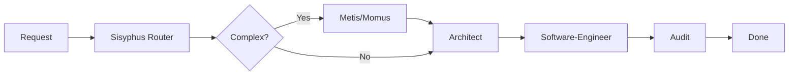

# WANDA Agent Roster
## Complete Agent Reference

> **17 Agents | 7 Layers | 4 Plugin Systems | 1 Unified System**

---

## Quick Reference

| Layer | Agent | Model | Trigger |
|-------|-------|-------|---------|
| 1 | Brainstormer | Gemini Pro | `@brainstormer`, "brainstorm" |
| 2 | Sisyphus | Gemini Flash | Always active (router) |
| 3 | Architect | Claude Opus | `/ralph-loop`, "design" |
| 3 | Software-Engineer | Claude Sonnet | "code", "implement" |
| 3 | Frontend-UI-UX | Gemini Pro | "ui", "frontend" |
| 3 | Audit | Claude Opus | "review", "audit" |
| 4 | Oracle | Gemini Pro | "research", "search" |
| 4 | Writer | Gemini Pro | "document", "readme" |
| 4 | Librarian | Gemini Flash | "remember", "recall" |
| 4 | Explore | Gemini Flash | "explore", "find" |
| 4 | Multimodal-Looker | Gemini Pro | "look at", "image" |
| 5 | Codebase-Locator | Gemini Flash | Background (read-only) |
| 5 | Codebase-Analyzer | Gemini Flash | Background (read-only) |
| 5 | Pattern-Finder | Gemini Flash | Background (read-only) |
| 6 | Ledger-Creator | Gemini Flash | Background (always) |
| 6 | Artifact-Searcher | Gemini Flash | "previous", "last session" |
| 7 | Metis | Claude Opus | `/plan`, complex tasks |
| 7 | Momus | Claude Opus | After Metis (auto) |

---

## Plugin System Mapping

| Plugin | Controls | Purpose |
|--------|----------|---------|
| **oh-my-opencode** | All agents | Primary orchestrator, agent routing |
| **MiCode** | UI personas | Visual interface, agent status display |
| **opencode-orchestrator** | Request classification | Intent detection, capability mapping |
| **OpenCode Core** | Execution | MCP servers, file operations |

---

## Workflow: /ralph-loop

**Phases:**
1. **Design** → Architect creates plan
2. **Implement** → Software-Engineer writes code
3. **Verify** → Audit reviews and approves

---

## Layer Descriptions

### Layer 1: Ideation
- **Pure creative exploration**
- NO code generation
- Design thinking, brainstorming

### Layer 2: Orchestration
- **Task routing and priority**
- Always active, invisible
- Manages agent queue

### Layer 3: Core
- **Primary work horses**
- Architecture, implementation, UI, review
- Most user interactions

### Layer 4: Specialist
- **Domain experts**
- Research, documentation, navigation
- Support roles

### Layer 5: Research (READ-ONLY)
- **Background analysis**
- Code understanding without modification
- Pattern detection

### Layer 6: Continuity
- **State management**
- Session persistence
- Artifact tracking

### Layer 7: Meta
- **Planning oversight**
- Plan before execute
- Quality control

---

## Conflict Resolution

When multiple agents could handle a request:

1. **Security First** → Audit takes priority
2. **Specialize** → Prefer domain expert over generalist
3. **Architecture Before Code** → Design then implement
4. **User History** → Consider past preferences

---

## File Locations

| File | Purpose |
|------|---------|
| `prompts/agents/*.md` | Individual agent SOTA prompts |
| `plugins/oh-my-opencode/config.yaml` | Agent roster & routing |
| `plugins/micode/config.json` | Visual personas |
| `plugins/orchestrator/routing.yaml` | Intent classification |
| `prompts/context/AGENT_REGISTRY.md` | Detailed agent specs |
| `prompts/context/MCP_TOOL_MAPPING.md` | MCP server assignments |

---

*WANDA Agent Roster v1.0.2*
