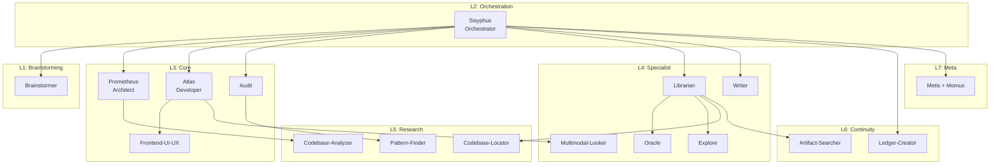

# WANDA Agent Roster v1.0.4

> **17 Agents**: 7 Primary + 10 Sub-Agents
> **9 Layers**: Brainstorming → Deploy

---

## Architecture Overview

---

## Agent Configuration

| # | Agent | Layer | Type | Model | Fallback | Skills |
|---|-------|-------|------|-------|----------|--------|
| 1 | **Sisyphus** | 2 | PRIMARY | kimi-code-k2p5 | kimi-k2.5-free | prompt-engineering |
| 2 | **Brainstormer** | 1 | PRIMARY+SUB | kimi-k2.5-free | gemini-3-flash | prompt-engineering |
| 3 | **Prometheus** | 3 | PRIMARY+SUB | claude-4.5-sonnet | kimi-k2.5-free | nextjs, api-design |
| 4 | **Atlas** | 3 | PRIMARY+SUB | claude-4.5-sonnet | kimi-code-k2p5 | react, tailwind, ts |
| 5 | **Audit** | 3 | PRIMARY+SUB | codex-5.2 | kimi-k2.5-free | security, testing |
| 6 | **Librarian** | 4 | PRIMARY+SUB | gemini-3-flash | kimi-k2.5-free | - |
| 7 | **Writer** | 4 | PRIMARY+SUB | gemini-3-flash | kimi-k2.5-free | docs, git-commits |
| 8 | Frontend-UI-UX | 3 | SUB | gemini-3-pro | kimi-k2.5-free | react, a11y |
| 9 | Oracle | 4 | SUB | claude-4.5-opus | gemini-3-pro | - |
| 10 | Explore | 4 | SUB | gemini-3-flash | kimi-k2.5-free | - |
| 11 | Multimodal-Looker | 4 | SUB | kimi-k2.5-free | gemini-3-flash | - |
| 12 | Codebase-Locator | 5 | SUB | gemini-3-flash | kimi-k2.5-free | - |
| 13 | Codebase-Analyzer | 5 | SUB | codex-5.2 | kimi-k2.5-free | - |
| 14 | Pattern-Finder | 5 | SUB | codex-5.2 | kimi-k2.5-free | - |
| 15 | Ledger-Creator | 6 | SUB | gemini-3-flash | kimi-k2.5-free | - |
| 16 | Artifact-Searcher | 6 | SUB | gemini-3-flash | kimi-k2.5-free | - |
| 17 | Metis + Momus | 7 | SUB | gemini-3-flash | kimi-k2.5-free | - |

---

## 9 Layers (Workflow Phases)

| Layer | Name | Description |
|-------|------|-------------|
| 1 | Brainstorming | Ideation, Creativity |
| 2 | Planning | Strategy, Task Distribution |
| 3 | Architecture | Project Setup, Structure |
| 4 | Development | Implementation |
| 5 | Audit | Code Review, Safety |
| 6 | Refactor | Cleanup, Optimization |
| 7 | Testing | Smoke, Integration, E2E |
| 8 | User-Approval | User confirms |
| 9 | Deploy | Final Release |

---

## Triggers

| Agent | Trigger |
|-------|---------|
| Sisyphus | Always active (default) |
| Brainstormer | `@brainstormer` |
| Prometheus | `@architect` |
| Atlas | `@dev` |
| Audit | `@audit` |
| Librarian | `@librarian` |
| Writer | `@writer` |

---

*WANDA Agent Roster v1.0.4*
