# WANDA Agent Roster v1.0.3
## 7 Primary Agents | Clean Architecture

> **7 Primary Agents | 10 Sub-Agents | Dual-Role Architecture**

---

## Quick Reference

| # | Agent | Model (Primary) | Fallback | Trigger |
|---|-------|-----------------|----------|---------|
| 1 | 🎯 **Orchestrator** | kimi-code-k2p5 | kimi-k2.5-free | Always active |
| 2 | 💡 **Brainstormer** | kimi-k2.5-free | gemini-3-flash | @brainstormer |
| 3 | 📚 **Librarian** | gemini-3-flash | kimi-k2.5-free | @librarian |
| 4 | 🏗️ **Architect** | kimi-k2.5-free | gemini-3-flash | @architect |
| 5 | 👨‍💻 **Developer** | gemini-3-flash | kimi-k2.5-free | @dev |
| 6 | 🔍 **Audit** | gemini-3-flash | kimi-k2.5-free | @audit |
| 7 | ✍️ **Writer** | gemini-3-flash | kimi-k2.5-free | @writer |

---

## Architecture Diagram

```mermaid
graph TB
    User([User Input])

    subgraph WANDA["WANDA Agent System v1.0.3"]
        Orch["🎯 Orchestrator<br/>kimi-code-k2p5"]

        Brain["💡 Brainstormer<br/>kimi-k2.5-free"]
        Lib["📚 Librarian<br/>gemini-3-flash"]
        Arch["🏗️ Architect<br/>kimi-k2.5-free"]
        Dev["👨‍💻 Developer<br/>gemini-3-flash"]
        Audit["🔍 Audit<br/>gemini-3-flash"]
        Writer["✍️ Writer<br/>gemini-3-flash"]
    end

    User --> Orch
    Orch --> Brain
    Orch --> Lib
    Orch --> Arch
    Orch --> Dev
    Orch --> Audit
    Orch --> Writer
    Orch --> Output([Result])
```

---

## 7-Layer Architecture

| Layer | Agents | Purpose |
|-------|--------|---------|
| 1 | Brainstormer | Ideation |
| 2 | Orchestrator | Routing |
| 3 | Architect, Developer, Audit | Core Work |
| 4 | Librarian, Writer, Oracle, Explore | Specialist |
| 5 | Codebase-Locator, Analyzer, Pattern-Finder | Research (READ-ONLY) |
| 6 | Ledger-Creator, Artifact-Searcher | Continuity |
| 7 | Metis, Momus | Meta Planning |

---

## Primary Agents (Dual-Role)

All 7 primary agents have `is_primary: true` AND `is_subagent: true`:

### 1. Orchestrator (Layer 2)
- **Controls**: All agents, Metis, Momus
- **Role**: Main brain - routes, plans, executes
- **MCP**: filesystem, memory, github, docker, brave, context7

### 2. Brainstormer (Layer 1)
- **Role**: Creative exploration, NO code
- **MCP**: memory

### 3. Librarian (Layer 4)
- **Controls**: Oracle, Explore, Artifact-Searcher, Codebase-Locator
- **Role**: Research, knowledge, context
- **MCP**: memory, context7, brave, firecrawl

### 4. Architect (Layer 3)
- **Controls**: Codebase-Analyzer
- **Role**: Design, ADRs, planning
- **MCP**: memory, filesystem, github, sequential-thinking

### 5. Developer (Layer 3)
- **Controls**: Frontend-UI-UX, Multimodal-Looker
- **Role**: Implementation, UI, backend
- **MCP**: filesystem, github, git, context7, playwright, vercel

### 6. Audit (Layer 3)
- **Controls**: Pattern-Finder
- **Role**: Review, debug, security, QA
- **MCP**: filesystem, github, sequential-thinking

### 7. Writer (Layer 4)
- **Role**: Documentation, README, tutorials
- **MCP**: filesystem, memory

---

## Sub-Agents (10 total)

| Sub-Agent | Layer | Controlled By |
|-----------|-------|---------------|
| Frontend-UI-UX | 3 | Developer |
| Oracle | 4 | Librarian |
| Explore | 4 | Librarian |
| Multimodal-Looker | 4 | Developer |
| Codebase-Locator | 5 | Librarian |
| Codebase-Analyzer | 5 | Architect |
| Pattern-Finder | 5 | Audit |
| Ledger-Creator | 6 | Orchestrator |
| Artifact-Searcher | 6 | Librarian |
| Metis, Momus | 7 | Orchestrator |

---

## Deactivated (Merged)

| Agent | Merged Into | Reason |
|-------|-------------|--------|
| ~~Sisyphus~~ | Orchestrator | Duplicate routing function |

---

## /ralph-loop Workflow

---

## Model Selection Matrix

Configure in `config/agents.yaml`:

| Subscription | Orchestrator | Architect | Developer | Audit |
|--------------|--------------|-----------|-----------|-------|
| **Free** | kimi-k2.5-free | kimi-k2.5-free | gemini-3-flash | gemini-3-flash |
| **Kimi K2P5** | kimi-code-k2p5 | kimi-k2.5-free | gemini-3-flash | gemini-3-flash |
| **Claude Pro** | kimi-k2.5-free | claude-4.5-sonnet | gemini-3-flash | gemini-3-flash |
| **Claude Max** | kimi-code-k2p5 | claude-4.5-opus | gemini-3-flash | claude-4.5-sonnet |
| **OpenAI Pro** | kimi-k2.5-free | kimi-k2.5-free | openai/codex-5.2 | gemini-3-flash |

---

## File Locations

| File | Purpose |
|------|---------|
| `config/agents.yaml` | **MAIN CONFIG** - Edit models here |
| `prompts/agents/*.md` | Agent system prompts |
| `plugins/oh-my-opencode/config.yaml` | Plugin routing |
| `docs/WANDA_HANDBOOK.html` | Visual documentation |

---

*WANDA v1.0.3 - 7 Primary Agents, Clean Architecture*
