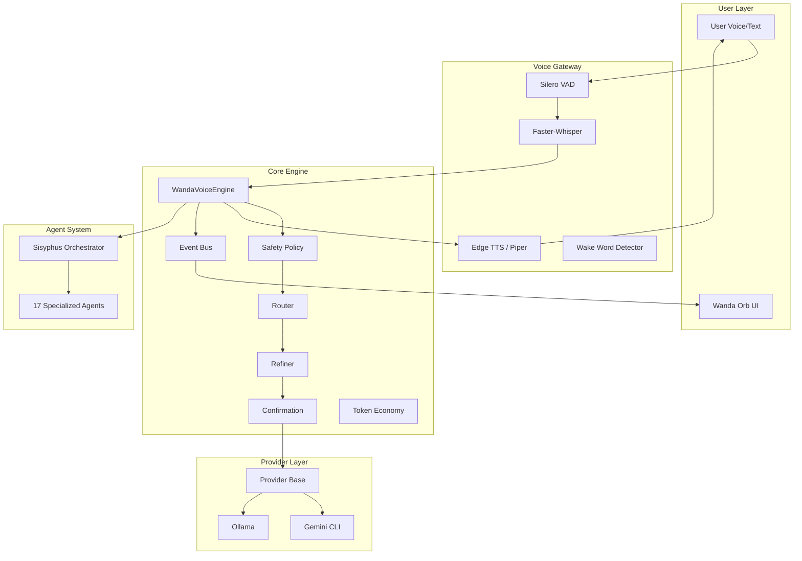
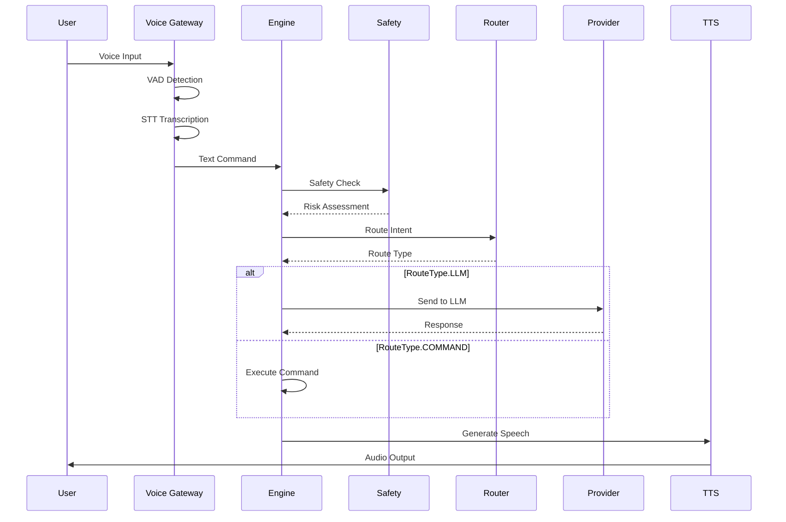

# WANDA Sovereign AI OS – FINAL BLUEPRINT
> **Version:** 2.0.0 (Production Ready)  
> **Status:** Implementation Phase  
> **Date:** 2026-02-05  
> **Classification:** Single Source of Truth (SSOT)

---

## 1. Executive Summary

**WANDA** (Workspace-Aware Neural Development Assistant) ist ein **souveränes, agentisches KI-Betriebssystem**, das:

1. **Lokale Sprachverarbeitung** (STT/TTS/VAD) mit Cloud-Agent-Intelligenz kombiniert
2. **17 spezialisierte Agenten** über 7 Layer orchestriert
3. **Autonome Software-Entwicklung** mit menschlicher Aufsicht ermöglicht
4. **Souveräne Datenkontrolle** durch lokale Ausführung garantiert

**Vision:** Ein dezentrales, autonomes und persönliches KI-Betriebssystem, das die Lücke zwischen biologischem Denken und digitaler Ausführung schließt.

---

## 2. Single Source of Truth – Endgültige Definitionen

### 2.1 Die 7 Layer (Korrigiert & Final)

| Layer | Name | Purpose | Primary Agent | Model |
|:---:|:---|:---|:---|:---|
| **1** | **Ideation** | Konzeptualisierung & Design | Brainstormer | Gemini 3 Pro |
| **2** | **Orchestration** | Task Routing & Coordination | **Sisyphus** | Gemini 3 Flash |
| **3** | **Core** | Technische Umsetzung | Architect, Software-Engineer, Audit, Frontend-UI-UX | Claude 4.5 / Sonnet |
| **4** | **Specialist** | Tiefenwissen & Expertise | Oracle, Writer, Librarian | Gemini Pro / RAG |
| **5** | **Research** | Codebase Exploration | Codebase-Locator, Codebase-Analyzer, Pattern-Finder | Gemini Flash |
| **6** | **Continuity** | Kontexterhaltung | Ledger-Creator, Artifact-Searcher | Lokale Vector-DB |
| **7** | **Meta** | Plan-Optimierung & Review | Metis, Momus | Claude Opus Thinking |

**⚠️ Wichtig:** Sisyphus ist der **alleinige Orchestrator**. Der "Commander" aus älteren Dokumenten ist veraltet.

### 2.2 Die 17 Agenten (Korrigiert & Final)

| # | Agent | Layer | Rolle | Model |
|:---:|:---|:---:|:---|:---|
| 1 | **Brainstormer** | 1 | Ideator | Gemini 3 Pro |
| 2 | **Sisyphus** | 2 | Orchestrator | Gemini 3 Flash |
| 3 | **Architect** | 3 | Grounder | Claude 4.5 Opus (Thinking) |
| 4 | **Software-Engineer** | 3 | Builder | Claude 4.5 Sonnet |
| 5 | **Frontend-UI-UX** | 3 | Designer | Gemini 3 Pro |
| 6 | **Audit** | 3 | Fixer+Reviewer | Claude 4.5 Opus (Thinking) |
| 7 | **Oracle** | 4 | Think Tank | Claude 4.5 Opus (Thinking) |
| 8 | **Writer** | 4 | Tech Writer | Gemini 3 Flash |
| 9 | **Librarian** | 4 | Researcher | Gemini 3 Flash |
| 10 | **Codebase-Locator** | 5 | Locator | Gemini 3 Flash |
| 11 | **Codebase-Analyzer** | 5 | Analyzer | Gemini 3 Flash |
| 12 | **Pattern-Finder** | 5 | Pattern Scout | Gemini 3 Flash |
| 13 | **Ledger-Creator** | 6 | Continuity Keeper | Gemini 3 Flash |
| 14 | **Artifact-Searcher** | 6 | History Scout | Gemini 3 Flash |
| 15 | **Metis** | 7 | Pre-Planning Consultant | Claude 4.5 Opus (Thinking) |
| 16 | **Momus** | 7 | Plan Reviewer | Claude 4.5 Opus (Thinking) |
| 17 | **Explore** | 5 | Mapper | Gemini 3 Flash |

---

## 3. System Architecture

### 3.1 High-Level Architecture



### 3.2 Datenfluss



### 3.3 Modul-Struktur

```
wanda-agentic-system/
├── wanda-voice/                    # Frontend/Voice Interface
│   ├── main.py                     # Entry Point
│   ├── audio/                      # Audio I/O
│   ├── stt/                        # Speech-to-Text
│   ├── tts/                        # Text-to-Speech
│   ├── ui/                         # GTK UI (Orb, Log Window)
│   └── conversation/               # State Machine, Commands
├── wanda_voice_core/               # Backend Engine
│   ├── engine.py                   # Core Pipeline
│   ├── schemas.py                  # Data Models
│   ├── config.py                   # Configuration
│   ├── router.py                   # Intent Routing
│   ├── safety.py                   # Safety Policy
│   ├── refiner.py                  # Prompt Refinement
│   ├── confirmation.py             # Confirmation Flow
│   ├── token_economy.py            # Token Management
│   ├── event_bus.py                # Event System
│   ├── api.py                      # API Endpoints
│   ├── run_manager.py              # Execution Management
│   └── providers/                  # LLM Providers
│       ├── base.py
│       ├── gemini_cli.py
│       └── ollama.py
├── tests/                          # Test Suite
├── skills/                         # Agent Skills (YAML)
├── templates/                      # Configuration Templates
├── docs/                           # Documentation
└── scripts/                        # Utility Scripts
```

---

## 4. Implementation Status

### 4.1 ✅ Vollständig Implementiert

| Komponente | Status | Tests |
|:---|:---:|:---:|
| Voice Gateway (Edge TTS) | ✅ | ⚠️ |
| Safety Policy (Deny/Caution/Allow) | ✅ | ✅ |
| Intent Router | ✅ | ✅ |
| Token Economy | ✅ | ✅ |
| Event Bus | ✅ | ⚠️ |
| Provider Abstraktion | ✅ | ✅ |
| Gemini CLI Provider | ✅ | ✅ |
| Ollama Provider | ✅ | ⚠️ |
| Confirmation Flow | ✅ | ✅ |
| Schema Validation | ✅ | ✅ |
| Configuration System | ✅ | ⚠️ |

### 4.2 ⚠️ Teilweise Implementiert

| Komponente | Status | Fehlend |
|:---|:---:|:---|
| Wake Word Detection | ⚠️ | OpenWakeWord Integration unvollständig |
| VAD Integration | ⚠️ | Nur Smoke Tests |
| UI Tests | ⚠️ | Keine automatisierten GTK Tests |
| E2E Tests | ⚠️ | Nur manuelle Tests |
| Logging | ⚠️ | Print statt strukturiertes Logging |

### 4.3 ❌ Nicht Implementiert

| Komponente | Priorität | Komplexität |
|:---|:---:|:---:|
| Docker Sandboxing | 🔴 Hoch | Hoch |
| Vollständiger Audit-Agent | 🔴 Hoch | Hoch |
| Wanda-Mode Autonomie | 🔴 Hoch | Sehr Hoch |
| Coqui XTTS-v2 | 🟡 Mittel | Mittel |
| Lokale Vector-DB | 🟡 Mittel | Mittel |
| Clipboard Integration | 🟢 Niedrig | Niedrig |
| Active Window Detection | 🟢 Niedrig | Niedrig |

---

## 5. Critical Issues (Nach Priorität)

### 🔴 Kritisch (Sicherheit)

| Issue | Datei | Beschreibung | Fix |
|:---|:---|:---|:---|
| **CLI Prompt Leak** | `providers/gemini_cli.py:106` | Prompt als CLI-Argument sichtbar in Prozessliste | Umstellen auf stdin oder temp file |
| **Binary Patcher ohne Integrität** | `scripts/rebrand_binary.py:14` | Keine Integritätsprüfung, kein Rollback | Checksummen + Backup-Strategie |
| **Fehlende Safety Coverage** | `tests/test_smoke.py:17` | Tests prüfen falsches Modul | Tests auf `wanda_voice_core.safety` umstellen |

### 🟡 Hoch (Qualität)

| Issue | Datei | Beschreibung | Fix |
|:---|:---|:---|:---|
| **Doppelte TokenMetrics** | `schemas.py:131` + `token_economy.py:96` | Zwei Definitionen derselben Klasse | Konsolidieren in schemas.py |
| **Unbenutzte Variable** | `engine.py:382` | Totes Code-Fragment | Entfernen |
| **Print statt Logging** | Mehrere Dateien | Kein strukturiertes Logging | Logging-Framework einführen |

### 🟢 Mittel (Verbesserung)

| Issue | Beschreibung |
|:---|:---|
| UI-Tests fehlen | Keine automatisierten Tests für GTK-Komponenten |
| Hardware-Tests fehlen | Keine Tests für VAD/STT auf verschiedenen Systemen |
| Dokumentation inkonsistent | Mehrere widersprüchliche Dokumente |

---

## 6. Tech Stack (Endgültig)

### 6.1 Core Stack

| Komponente | Technologie | Version |
|:---|:---|:---:|
| Language | Python | 3.12+ |
| STT | faster-whisper | large-v3-turbo |
| TTS | Edge TTS (Seraphina) | latest |
| VAD | Silero VAD | v4.0 |
| LLM (Cloud) | Gemini 3 / Claude 4.5 | latest |
| LLM (Local) | Ollama | 0.3+ |
| UI | GTK4 / PyGObject | latest |
| Testing | pytest | 8.0+ |

### 6.2 Agent Models

| Agent | Model | Context |
|:---|:---|:---:|
| Brainstormer | Gemini 3 Pro | 128k |
| Sisyphus | Gemini 3 Flash | 128k |
| Architect | Claude 4.5 Opus (Thinking) | 200k |
| Software-Engineer | Claude 4.5 Sonnet | 200k |
| Audit | Claude 4.5 Opus (Thinking) | 200k |
| Frontend-UI-UX | Gemini 3 Pro | 128k |
| Oracle | Claude 4.5 Opus (Thinking) | 200k |
| Alle anderen | Gemini 3 Flash | 128k |

---

## 7. Quality Gates (Definition of Done)

### 7.1 Für jeden Layer

```yaml
Layer_1_Ideation:
  - Design-Dokument erstellt
  - User Stories definiert
  - Akzeptanzkriterien dokumentiert
  - Review durch Product Owner

Layer_2_Orchestration:
  - Task-Plan erstellt
  - Abhängigkeiten identifiziert
  - Ressourcen zugewiesen
  - Zeitplan definiert

Layer_3_Core:
  - Code implementiert
  - Unit Tests > 80% Coverage
  - Integration Tests bestehen
  - Linting & Formatierung OK
  - Code Review bestanden
  - Dokumentation aktualisiert

Layer_4_Specialist:
  - Experten-Review bestanden
  - Best Practices eingehalten
  - Performance-Optimierung OK

Layer_5_Research:
  - Codebase-Analyse dokumentiert
  - Patterns identifiziert
  - Risiken bewertet

Layer_6_Continuity:
  - Ledger aktualisiert
  - Kontext für nächste Session gesichert
  - Artefakte archiviert

Layer_7_Meta:
  - Plan-Review bestanden
  - Lessons Learned dokumentiert
  - Prozess-Verbesserungen identifiziert
```

### 7.2 Allgemeine Gates

- ✅ **Compiles without errors**
- ✅ **Tests pass** (Unit + Integration)
- ✅ **Lint clean** (ruff/mypy)
- ✅ **Audit passed** (Security Review)
- ✅ **Documentation updated**
- ✅ **Ledger updated**

---

## 8. Phase Plan

### Phase 1: Foundation (Woche 1)
- [ ] Kritische Sicherheitsissues fixen
- [ ] Code-Konsolidierung (TokenMetrics)
- [ ] Logging-Framework einführen
- [ ] Testabdeckung verbessern

### Phase 2: Core Stability (Woche 2)
- [ ] Vollständige Testabdeckung für Core
- [ ] UI-Tests implementieren
- [ ] E2E-Tests automatisieren
- [ ] Dokumentation konsolidieren

### Phase 3: Feature Completion (Woche 3)
- [ ] Wake Word Detection vervollständigen
- [ ] Docker Sandboxing implementieren
- [ ] Audit-Agent vollständig implementieren
- [ ] Wanda-Mode Autonomie (Basis)

### Phase 4: Polish & Release (Woche 4)
- [ ] Performance-Optimierung
- [ ] Finaler Audit
- [ ] Release-Dokumentation
- [ ] Deployment vorbereiten

---

## 9. Nächste Schritte

### Sofort (Heute)
1. **Software-Engineer** fixt CLI Prompt Leak
2. **Software-Engineer** konsolidiert TokenMetrics
3. **Audit** führt Security-Review durch

### Diese Woche
1. Alle kritischen Issues beheben
2. Testabdeckung auf > 90% erhöhen
3. Logging-Framework implementieren
4. UI-Tests erstellen

### Nächste Woche
1. Feature-Completion
2. Docker Sandboxing
3. Audit-Agent
4. Performance-Tuning

---

## 10. Anhänge

### A. Datei-Referenzen

**Hub Files (>10 Verbindungen):**
- `wanda-voice/main.py` - Haupt-Einstiegspunkt
- `wanda_voice_core/engine.py` - Pipeline-Orchestrierung
- `wanda_voice_core/schemas.py` - Datenmodelle
- `wanda_voice_core/event_bus.py` - Event-System

**Konfigurationsdateien:**
- `wanda-voice/wanda.config.yaml` - Voice-Konfiguration
- `wanda_voice_core/config.py` - Core-Konfiguration
- `config/agents.yaml` - Agent-Konfiguration
- `config/voice_commands.yaml` - Voice-Befehle

### B. Test-Struktur

```
tests/
├── conftest.py              # Fixtures
├── test_schemas.py          # Schema-Validierung ✅
├── test_safety.py           # Safety Policy ⚠️
├── test_router.py           # Intent Routing ✅
├── test_refiner.py          # Prompt Refinement ✅
├── test_confirmation.py     # Confirmation Flow ✅
├── test_token_economy.py    # Token Management ✅
├── test_vad.py              # VAD Integration ⚠️
├── test_gemini_timeout.py   # Provider Timeout ✅
├── test_clipboard.py        # Clipboard ⚠️
├── test_smoke.py            # Smoke Tests ⚠️
└── test_recorder.py         # Audio Recorder ⚠️
```

**Legende:**
- ✅ Gut abgedeckt
- ⚠️ Teilweise/Lücken
- ❌ Fehlt

---

> **"WANDA ist nicht nur ein Tool. Sie ist die Manifestation deiner souveränen digitalen Identität."**

**END OF BLUEPRINT**
